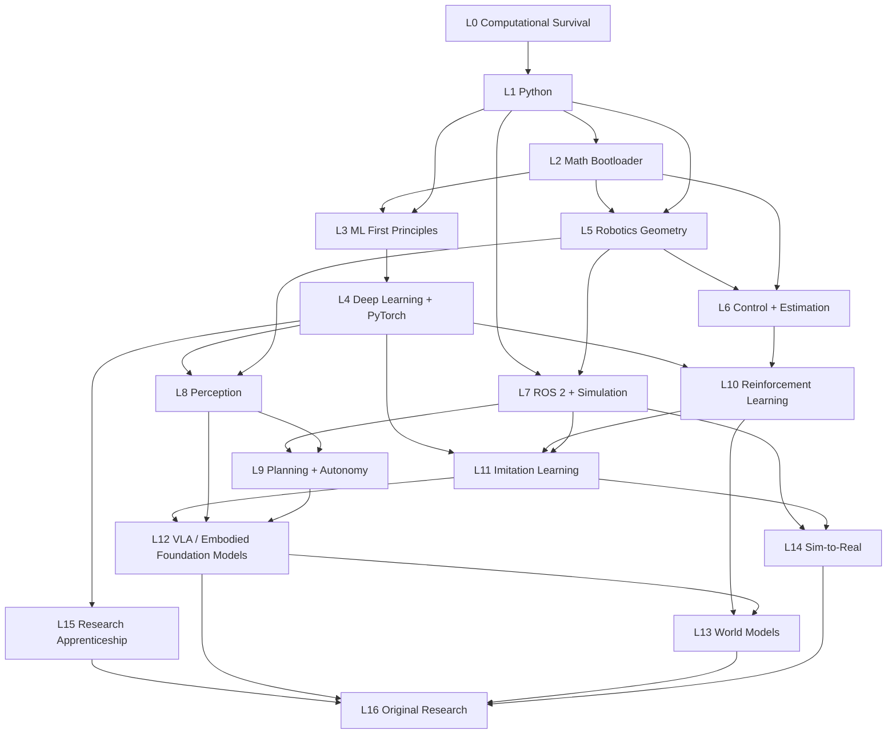

# The Skill Dependency Graph — Design Document

**Status:** v1.0 — structure finalized; resource bindings live in `src/content/` (single source of truth for node data).
**Date:** 2026-08-21

This document explains *why* the graph is shaped the way it is. The machine-readable graph
(every node with objectives, resources, exercises, mastery tests) lives in `src/content/nodes/`.

---

## 1. Design principles

1. **Mastery-gated, not calendar-gated.** A node unlocks the moment its prerequisites reach
   their required mastery tier — never because a date arrived. The 210-day calendar is a
   *pacing overlay* (ahead/behind indicator), not a lock.
2. **Four parallel tracks, every day.** The daily template (Math / Implementation / Core
   specialization / Project) maps to four semi-independent chains in the graph. Math never
   blocks programming; programming never blocks math. This is where most of the compression
   comes from: a university serializes these, we run them concurrently.
3. **Just-in-time math.** Math is taught at the last responsible moment, always with a
   consumer node waiting: probability lands the week before ML losses need it; SO(3)/SE(3)
   lands the week kinematics needs it. No math node exists without a named downstream consumer.
4. **Every concept is implemented.** A node is not "done" at recognition (Bronze). Core nodes
   gate at **Gold = built/derived it without copying**. The graph encodes the minimum tier
   each edge actually requires.
5. **Research habits start at ~20% of the program, not 80%.** Paper-reading nodes (L15) have
   deliberately *low* prerequisites so the research apprenticeship interleaves from Month 2.
6. **Diagnostic-skip on every node.** Each node carries a skip test; passing at Gold marks it
   mastered instantly. Fast learners route around anything they already know.

## 2. Track model

| Track | Chain | Feeds |
|---|---|---|
| **A — Math** | algebra → functions → calc → linalg → prob/stats → optimization → SO(3)/SE(3) → filters | ML theory, robotics geometry, estimation |
| **B — Code** | terminal/git → Python → NumPy → PyTorch → training craft → C++ literacy → ROS 2 | everything |
| **C — Specialization** | ML → DL → transformers/ViT → robotics theory → perception/planning → RL/IL → VLA/world models | research |
| **D — Project/Research** | project ladder P1→P22 + paper ladder + experiments | capstone |

Tracks A and B run concurrently from Day 1. Track C begins when B reaches NumPy and A reaches
calculus basics (~Day 18–24 for a fast learner). Track D is continuous.

## 3. Macro-graph (level granularity)



Key structural choices vs. a naive linear program:

- **L5–L7 (robotics core) does not wait for L4 (deep learning).** Geometry/kinematics depend
  on linear algebra + Python only. In practice DL and robotics-geometry interleave in
  Months 2–3, which keeps both tracks daily-active.
- **L9 (classical planning) is deliberately thin** and mostly feeds *context* to L12, not hard
  prerequisites. Modern learned-policy research consumes far less classical planning than a
  2015 curriculum would suggest; we teach A*/RRT + MoveIt literacy, not a planning PhD.
- **L10 (RL) gates L11 conceptually (MDP formalism) but not chronologically** — imitation
  learning starts as soon as the learner can train a Transformer; only the RL-finetuning
  nodes of L12+ hard-require PPO understanding.
- **L15 has edges *into* nearly everything** — reading/reproduction methodology is a
  co-requisite of Months 2+, not a final chapter.

## 4. Node inventory and budgeted hours

Granularity target: a node = one sitting-to-three-days of work (2–12 h). 149 nodes total (final, validator-counted).

| Level | Nodes | Core hours | Stretch hours | Gate |
|---|---|---|---|---|
| L0 Computational Survival | 8 | 26 | +6 | exit check |
| L1 Programming From Zero | 12 | 64 | +10 | **Programming Boss** |
| L2 Mathematical Bootloader | 14 | 130 | +20 | **Math Boss** |
| L3 ML First Principles | 8 | 42 | +6 | gate quiz |
| L4 Deep Learning + PyTorch | 12 | 85 | +12 | **DL Boss** |
| L5 Robotics Geometry | 10 | 58 | +8 | **Robotics Boss** |
| L6 Control + Estimation | 9 | 48 | +8 | project gate |
| L7 ROS 2 + Simulation | 8 | 52 | +8 | project gate |
| L8 Perception | 8 | 38 | +6 | project gate |
| L9 Planning + Autonomy | 7 | 34 | +6 | **Autonomy Boss** |
| L10 Reinforcement Learning | 9 | 50 | +8 | gate quiz + impl |
| L11 Imitation Learning | 9 | 52 | +8 | **Robot Learning Boss** |
| L12 VLA | 10 | 56 | +10 | **VLA Boss** |
| L13 World Models | 6 | 32 | +8 | experiment gate |
| L14 Sim-to-Real | 5 | 18 | +10 (hw) | checklist |
| L15 Research Apprenticeship | 7 | 34 | ongoing | reproduction |
| L16 Original Research | 6 | ~120 | — | **Final Boss** |
| **Total** | **149** | **939** | **+8 (hw track)** | |

Hour budgets are the research-audited numbers (see `03-curriculum-audit.md` §E); the
fast-learner-with-diagnostics case lands at the low end of each report's range.
Budget check: 30 weeks × 6 days × 5–7 h = **900–1,260 focused hours**.
Core path (939 h, validator-counted) + weekly reviews (30 × 3 h = 90 h) = **1,029 h** → fits at a 5.7 h/day
average with the 7 h/day ceiling leaving ~250 h of headroom for stretch content and
overruns. Detailed feasibility math in `06-feasibility.md`.

## 5. Critical path

The longest prerequisite chain (the true floor on program length):

```
algebra → calculus → multivariable → linalg core → prob → ML-from-scratch →
PyTorch → attention → Transformer → ViT/CLIP → BC → ACT → Diffusion Policy →
VLA anatomy → OpenVLA/π0 fine-tune → VLA Boss → reproduction → original research
```

≈ 19 sequential stages, ≈ 420 h of strictly ordered work. At 3 h/day on the critical track
(the other 2.5–4 h/day go to parallel tracks), the critical path completes ≈ Day 140,
leaving 70 days of frontier + research work. This is the number that makes 210 days credible:
**the critical path uses under half the daily budget because everything else parallelizes.**

## 6. Edge semantics

Edges carry a minimum tier: e.g. `l2-eigen →(Silver)→ l4-attention` (you need to *use*
eigen-intuition, not re-derive SVD, before attention), but `l3-mlp-numpy →(Gold)→ l4-pytorch`
(you must have *built* backprop before autograd is allowed to hide it). The engine treats a
prerequisite as satisfied when the source node's recorded tier ≥ edge tier. Default edge
tier: Silver. Gold edges are reserved for the "no framework before first principles" rule:

- backprop-by-hand **Gold-gates** PyTorch autograd
- kinematics-library **Gold-gates** MoveIt/frameworks
- tabular Q-learning + REINFORCE **Gold-gates** SB3/RL libraries
- raw training loop **Gold-gates** Lightning/Trainer abstractions

## 7. What was deliberately cut from a traditional path

Removed (with the reasoning recorded in `03-curriculum-audit.md`): frequency-domain control
(Bode/root-locus), deep DH-parameter drilling (PoE-first), full Featherstone dynamics
derivations, classical feature-based CV (SIFT-era) beyond intuition, deep SLAM internals,
LeetCode-style algorithms, generic software engineering, months-long C++, electronics.
Each cut has a one-line "when you'd need it" pointer in the app's reference layer.
